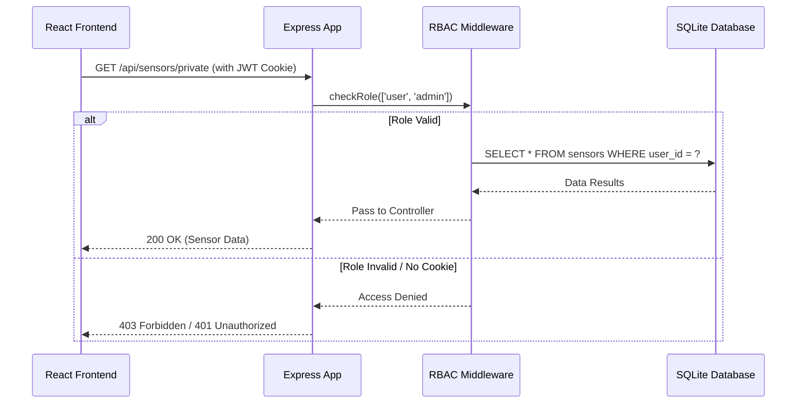

# Login Page

### 1. Request Lifecycle & RBAC Flow

This diagram shows how a request (like "Edit Dashboard") is intercepted by your middleware to check if the user has the correct role before touching the database.



---

### 2. Layout Distribution (12-Column Grid)

This table visualizes how the CSS grid columns are allocated based on the user's role.

| Role | Sidebar (Col 1-3) | Main Content (Col 4-12) | Header Actions |
| --- | --- | --- | --- |
| **Guest** | [ Empty ] | **Full Width (1-12)** | Login / Sign Up |
| **User** | Nav, Profile, Settings | Sensor Graph + Config | Logout, User Icon |
| **Admin** | Nav, User Mgmt, Logs | Global Sensor CRUD | Logout, Admin Badge |

---

### 3. Data Flow (Component Architecture)

This bash-style visualization shows how the `AuthContext` you are about to build acts as the "brain" for the frontend, feeding data to the rest of the app.

```bash
[ AuthContext (Provider) ]
    |
    |-- State: { user: { role: 'admin' }, loading: false }
    |
    |---- [ Layout Wrapper ] ---------------------------------------+
    |     | (Reads context.role to set CSS Grid template)           |
    |     |                                                         |
    |     |-- [ Sidebar ] <--- (Hidden if guest)                    |
    |     |                                                         |
    |     |-- [ Dashboard Page ]                                    |
    |           |-- [ TimeRange Selector ] <--- (Disabled if guest) |
    |           |-- [ Recharts Component ]                          |
    |           |-- [ Admin CRUD Table ]   <--- (Only if admin)     |
    +---------------------------------------------------------------+

```

---

### 4. Database Relationship (ERD)

Even though SQLite is simple, the relationship between users and sensors is what makes your RBAC work.

| Table: `users` | Table: `sensors` |
| --- | --- |
| `id` (PK) | `id` (PK) |
| `username` | `user_id` (FK -> users.id) |
| `password_hash` | `sensor_type` (e.g., 'temp', 'humidity') |
| `role` ('guest', 'user', 'admin') | `value` |
| `created_at` | `timestamp` |

---

### Tip for Claude.code

When you ask Claude to build the **Frontend Layout**, show it this:

> "Implement the Layout using a `grid-template-columns: repeat(12, 1fr)` container. If `auth.user.role` is 'guest', make the `<Main />` component `grid-column: 1 / 13`. Otherwise, make `<Sidebar />` span `1 / 4` and `<Main />` span `4 / 13`."

**Would you like me to write the specific CSS Module code that handles this 12-column responsive toggle?**

# webauthn

If **Passwords** are like a physical key (which can be copied, stolen, or lost), **WebAuthn** is like using your **biometric thumbprint or a hardware security key** to unlock a website.

Applying the **Pareto Principle**: You don't need to understand the complex cryptography (Public Key Infrastructure) to use it. You just need to know that it is a browser standard that allows users to log in without a password, using their device's built-in security.

---

### 1. The Core Concept: Public-Key Cryptography

WebAuthn works by creating a "Key Pair" for every website you visit.

* **The Private Key:** Stays on your device (phone, laptop, YubiKey). It is never sent over the internet. It is protected by your PIN or Biometrics.
* **The Public Key:** Sent to the website's server. It’s useless to hackers because it can only *verify* a login, not *initiate* one.

---

### 2. How the Flow Works (The "Secret Handshake")

Instead of sending a password, the server sends a "Challenge."

1. **Challenge:** The server says, "Hey, can you sign this random string of text with your private key?"
2. **User Consent:** Your phone pops up: "Use FaceID to log into `sensor-dashboard.com`?"
3. **The Signature:** Your device signs the text and sends the signature back.
4. **Verification:** The server uses your **Public Key** to verify the signature. If it matches, you're in.

---

### 3. Why it’s "Un-phishable"

This is the most important 20% of WebAuthn knowledge.
In a traditional phishing attack, a fake website (e.g., `googIe.com` with a capital 'i') tricks you into typing your password.

With WebAuthn, your device **checks the domain name itself**. If the domain doesn't perfectly match the one used during registration, your device will refuse to sign the challenge. The user doesn't even get the option to "override" it.

---

### 4. Comparison with Other Auth Methods

| Method | Security Level | User Friction | Vulnerable to Phishing? |
| --- | --- | --- | --- |
| **Passwords** | Low | High (Memorization) | **Yes** |
| **SMS OTP** | Medium | Medium (Waiting for code) | **Yes** (Sim-swapping) |
| **WebAuthn** | **High** | **Low (One touch)** | **No** |

---

### 5. Implementation for your Dashboard

Integrating WebAuthn from scratch is very difficult (the "80%" of complexity). To stay efficient, most developers use a library or a service:

* **Simple Route:** Use an IdP like **Auth0** or **Clerk**—they have a "Passkeys" toggle that enables WebAuthn with one click.
* **Self-Hosted Route:** Use a library like `@simplewebauthn/server` for your Node.js backend. It handles the heavy lifting of verifying the cryptographic signatures.

---

### Summary for Claude.code

If you want to add this to your project later, tell Claude:

> "I want to implement **Passkeys** using WebAuthn. Use the `@simplewebauthn` library. Store the `credentialID` and `publicKey` in our SQLite `users` table, and create an endpoint to generate the authentication challenge."

**Since you are currently building an RBAC system, would you like to stick to JWT/Passwords for now to get the MVP running, or should we look at how to structure your SQLite table to support WebAuthn later?**

# Important Ideas

To build a professional-grade dashboard in 2026, you should look beyond just "logging in" and focus on **Hardening** and **Observability**.

Applying the Pareto Principle again: 20% of these configurations will prevent 80% of common exploits like Clickjacking, XSS, and Data Sniffing.

### 1. HTTP Security Headers (The "Shield")

Security headers are like "instructions" your Express server sends to the browser to tell it how to behave. Without them, the browser is too "trusting."

| Header | Analogy | What it prevents |
| --- | --- | --- |
| **CSP (Content Security Policy)** | The "Guest List" for scripts | **XSS:** Stops the browser from running any script that didn't come from your own domain. |
| **HSTS** | The "VIP Only" entrance | **Man-in-the-Middle:** Forces the browser to *only* use HTTPS, even if the user types `http://`. |
| **X-Frame-Options** | The "No Glass House" rule | **Clickjacking:** Prevents other sites from putting your dashboard inside an `<iframe>` to trick users into clicking buttons. |
| **X-Content-Type-Options** | The "Label Checker" | **MIME Sniffing:** Prevents the browser from "guessing" if a text file is actually a malicious script. |

---

### 2. The OWASP Top 10 (The "Threat Map")

The **OWASP Top 10** is the industry-standard list of the most critical web risks. In 2026, the #1 risk is still **Broken Access Control**—which is exactly what you are tackling with your RBAC system.

**The 80/20 of OWASP for your project:**

1. **Broken Access Control:** Ensure your server checks the user's role on *every* request, not just the initial login.
2. **Cryptographic Failures:** Use `Argon2` or `bcrypt` for passwords (never plain text) and **TLS 1.3** for data in transit.
3. **Injection:** Use **Parameterized Queries** in your SQLite code so a user can't type `DROP TABLE users` into a search bar.

---

### 3. Zero Trust Architecture (The "Verify Always" Rule)

In modern development, we no longer assume a user is "safe" just because they are logged in.

* **Audit Logs:** For your Admin CRUD, you must log *who* did *what*. If an Admin deletes a sensor, your database should have a record: `Admin_ID 5 deleted Sensor_ID 22 at 14:00`.
* **Least Privilege:** Give your "User" role the absolute minimum permissions. If they don't *need* to see other people's sensor names, don't even send that data in the JSON response.

---

### 4. Software Supply Chain (The "Ingredient Label")

In 2026, many hacks happen through your `node_modules`.

* **SBOM (Software Bill of Materials):** Keep track of your dependencies.
* **Tool Tip:** Run `npm audit` frequently. It’s the 20% effort that catches 80% of known vulnerabilities in the libraries you're using (like `express` or `recharts`).

---

### Strategy for Claude.code

When you're ready to "harden" the app, use this prompt:

> "Now that the functional dashboard is done, let's harden it. 1) Add the `helmet` middleware to Express to set secure HTTP headers. 2) Implement a strict **Content Security Policy (CSP)** that only allows scripts from 'self'. 3) Ensure all SQLite queries use **prepared statements** to prevent SQL injection."

**Since you're building a dashboard, would you like to see how to implement an "Audit Log" table in SQLite to track what your Admins are doing?**
